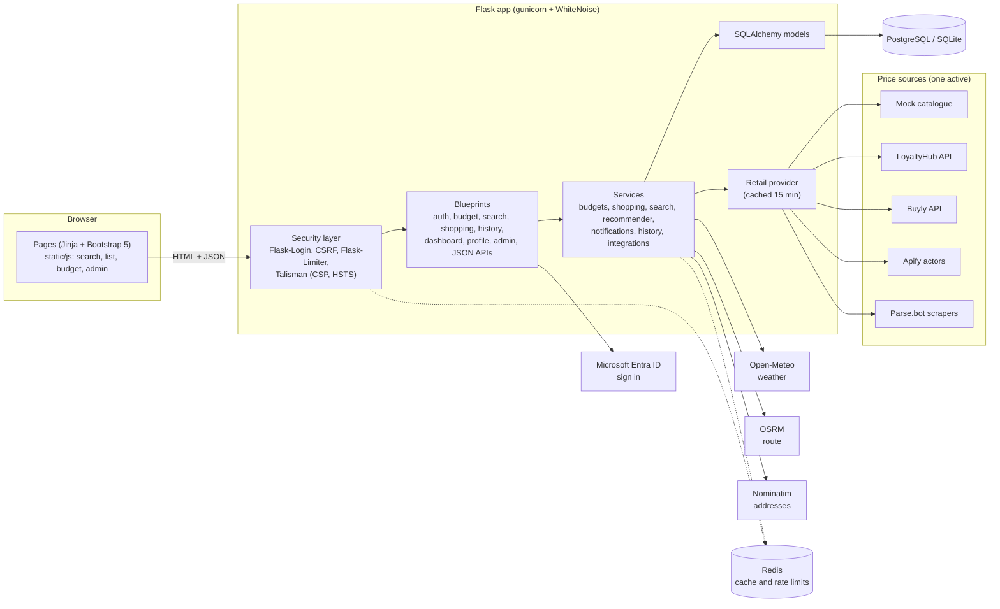
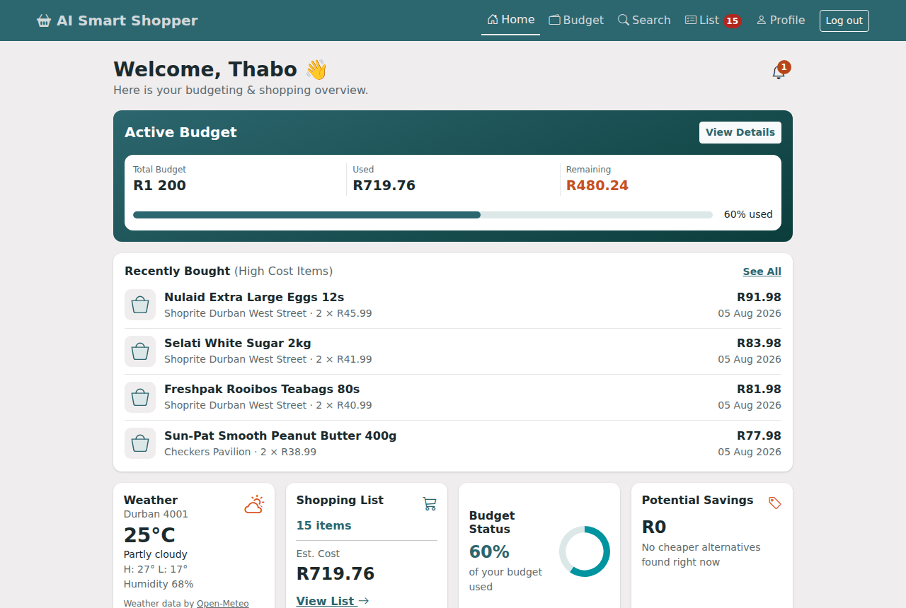
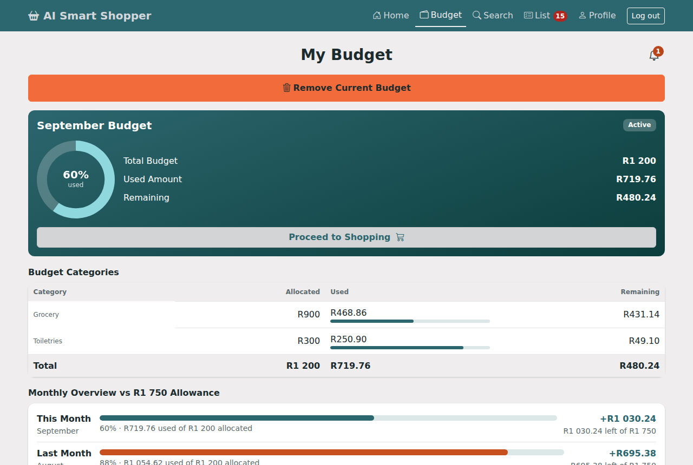
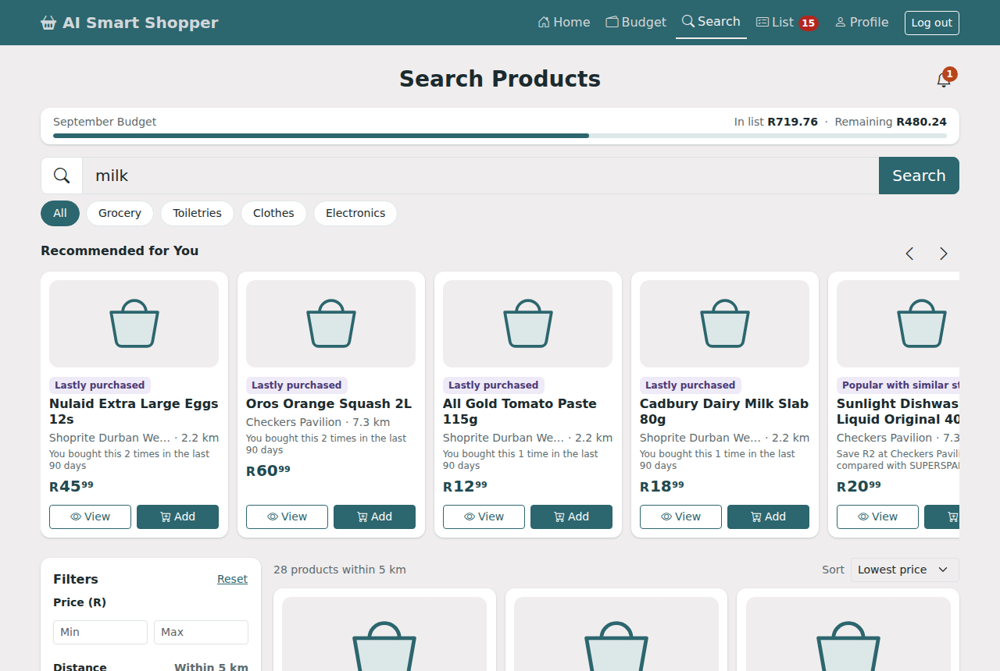
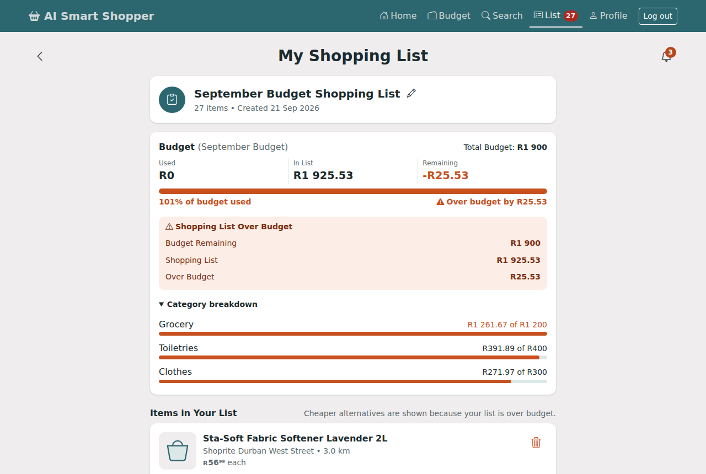
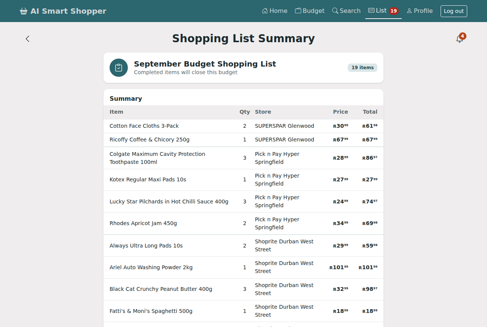
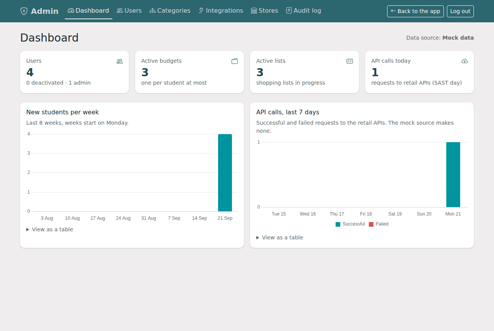

# AI Smart Shopper

A budgeting and price-comparison website for NSFAS students in Durban, KwaZulu-Natal. A student sets a monthly
budget, searches supermarket products near their residence, builds a shopping list that is checked against the
budget, sees the cheapest store for each item, and reviews the trip (invoice, route map, budget impact) before
shopping. It is a Flask **website**; a mobile app is planned once the web app is settled.

Rules the app is built around:

- The NSFAS meal allowance of **R1 750 a month** is a hard limit: a budget above what is left of it this month
  cannot be saved. Money already *spent* on budgets finished earlier in the month counts; money saved does not.
- Students sign up with their DUT student email (`...@dut4life.ac.za`, set by `STUDENT_EMAIL_DOMAIN`) and an ID
  number of exactly 13 digits (any digits are accepted; the box stops at 13).
- Visitors land on a public **home page** (top bar: Home, Products, About us, Contact us, Sign in, Create account)
  showing products around Durban; "Add to list" sends them to sign in and then to that product in search. **About
  us** has a **Contact us** form whose messages admins read under **Admin > Messages** (`CONTACT_EMAIL`,
  `CONTACT_PHONE`, `CONTACT_ADDRESS`, `CONTACT_HOURS` set the details shown). Every page ends with the same footer.
- The shopping list shows a map of the stores to travel to, redrawn as items change.
- On the shopping list each item has a **Purchased** button to tick it off in the shop before "Done – Purchase
  Completed". After Done, the student sees how much they used and how much they saved from the budget.
- A list that is **over budget** still accepts new items, but "Proceed to Summary" is disabled until it fits.
- A **Combined Budget** and individual category budgets (Grocery, Toiletries, Clothes) are mutually exclusive.
- Products with the **same barcode** are the same product and are grouped so their prices can be compared.
- All prices are in **ZAR** (shown as `R80`, `R1 750.50`). Times are stored in UTC and shown in South African time.
- The registration dropdown lists all DUT public residences. The map starts on Durban.

## Contents

1. [Quick start](#quick-start)
2. [Demo data](#demo-data)
3. [Configuration](#configuration)
4. [API keys](#api-keys) (LoyaltyHub, Buyly, Apify, Parse.bot, Open-Meteo, Microsoft)
5. [Architecture](#architecture)
6. [Route reference](#route-reference)
7. [Command-line tools](#command-line-tools)
8. [Tests and code style](#tests-and-code-style)
9. [Deployment](#deployment)
10. [Screenshots](#screenshots)
11. [What has and has not been verified](#what-has-and-has-not-been-verified)

## Quick start

Needs Python 3.11 or newer. Development uses SQLite, so nothing else has to be installed.

```bash
python -m venv .venv
source .venv/bin/activate            # Windows: .venv\Scripts\activate
pip install -r requirements-dev.txt  # runtime + tests + ruff/black

cp .env.example .env                 # the defaults work for local development
flask --app run db upgrade           # create the tables
flask --app run seed-stores          # 36 Durban branches: supermarkets and clothing shops
flask --app run seed-admin           # the built-in admin account (see below)
flask --app run seed-demo            # optional: three demo students (see below)
python run.py                        # http://127.0.0.1:5000
```

With `RETAIL_PROVIDER=mock` (the default) the app uses a built-in catalogue of more than 200 South African products, so
search, comparison, lists and budgets all work offline with no API keys. **The mock catalogue cannot show real product
photos or real prices** (its barcodes are invented, so it shows a picture of the aisle instead). For real photos, prices
and barcodes switch to [LoyaltyHub](#loyaltyhub-real-prices-barcodes-and-product-photos), which takes two minutes.

### Admin account

The admin signs in on the normal login page and lands on their own **Admin dashboard** (`/admin/`):

| Email | Password |
|---|---|
| `siya1@gmail.com` | `Siyabonga@2` |

`flask seed-admin` creates it (the Docker entrypoint does too), and it is also created the first time someone signs in
with exactly these details. **Change it on a public site** by setting `DEFAULT_ADMIN_EMAIL` and `DEFAULT_ADMIN_PASSWORD`
before the first start (or run `flask seed-admin` again after changing them).

From the admin portal the admin can:

- **Users**: search, add, edit, deactivate/reactivate and reset the password of any account.
- **Products > Add new product**: pick the category first (**Grocery**, **Toiletries** or **Clothing**), then the store
  from a drop-down of Durban branches with their addresses (the chosen store is shown on a map), then the details.
  Grocery and Toiletries ask for name, barcode, price, image (URL or upload) and stock status. Clothing asks for name,
  brand, SKU, size, colour, photos (URLs and/or uploads), price and stock. Clothing can only be added to clothing stores,
  groceries only to supermarkets. Products added here appear in student search straight away, next to the LoyaltyHub
  prices, and can be added to shopping lists.
- **Stores**: 36 known Durban branches (Checkers, Pick n Pay, Shoprite, Woolworths, SPAR, Mr Price, PEP, Ackermans,
  Edgars, Truworths, Jet). The newer ones use approximate positions at the shopping centre; `flask seed-stores --geocode`
  refines them. "Add known Durban stores" on the Stores page loads any that are missing.

Every finished trip in **Shopping History** has its own map: the route from the student's residence to each store on
that shopping list and back, with what was bought at each stop (the trip page adds road distance and travel time).

To give another student the admin role from the command line:

```bash
flask --app run make-admin you@example.com      # add --remove to take it away again
```

## Demo data

`flask seed-demo` creates three students, each with a budget, a shopping list and six months of finished trips.
Prices come from the mock catalogue, so the same command always produces the same data. All three sign in with the
password **`Demo!Pass123`**.

| Student | Email | Shows |
|---|---|---|
| Thabo Mokoena | `thabo.demo@example.com` | Individual budgets (Grocery R900, Toiletries R300), a list about 60% used |
| Nomvula Dlamini | `nomvula.demo@example.com` | One Combined Budget of R1 500, a list close to the limit |
| Sipho Ndlovu | `sipho.demo@example.com` | A R1 900 budget (NSFAS warning) and an over-budget list, so "Proceed to Summary" is disabled |

Run it again and existing demo students are left alone; `--reset` deletes just these three and rebuilds them (it refuses
if one of them is the only admin, so make your own account an admin first). It adds missing Durban branches but never
changes ones an admin edited, and it refuses to run with `APP_ENV=production` (the password is public) unless you add
`--allow-production`.

## Configuration

Everything is read from environment variables (a `.env` file is loaded automatically). `.env.example` lists them all
with comments. The ones you will touch first:

| Variable | Purpose |
|---|---|
| `APP_ENV` | `development` (default), `production` or `testing` |
| `SECRET_KEY` | Signs sessions and CSRF tokens. **Required in production, at least 32 characters** (placeholders such as `change-me` are refused): `python -c "import secrets; print(secrets.token_hex(32))"` |
| `DATABASE_URL` | PostgreSQL URL for production. Development uses `DEV_DATABASE_URL` (default `sqlite:///dev.db`) |
| `RETAIL_PROVIDER` | `mock` (default), `loyaltyhub`, `buyly`, `apify` or `parsebot`. An admin can switch it in the portal without a restart |
| `LOYALTYHUB_API_KEY` | LoyaltyHub key (real prices, barcodes and product photos). Optional: `LOYALTYHUB_CACHE_TTL` (seconds, default 900), `LOYALTYHUB_PAGE_SIZE` (rows per search, default 100, max 500) |
| `BUYLY_API_KEY` | Buyly beta key. Optional: `BUYLY_CACHE_TTL` (default 3600) |
| `APIFY_API_TOKEN`, `APIFY_ACTORS_JSON` | Apify credentials and which actor searches which retailer |
| `PARSEBOT_API_KEY`, `PARSEBOT_SCRAPERS_JSON` | Parse.bot credentials and scraper ids |
| `MS_CLIENT_ID`, `MS_CLIENT_SECRET` | "Sign in with Microsoft" (the button is hidden when these are empty) |
| `OPEN_METEO_URL` | Weather server (default: the free public one, no key) |
| `GUNICORN_TIMEOUT` | Seconds before gunicorn kills a silent worker (default: `APIFY_RUN_TIMEOUT` + 30 = 150, set in `gunicorn.conf.py`) |
| `REDIS_URL` | Shared cache and rate-limit counters. Set it whenever more than one worker runs |
| `FORCE_HTTPS`, `TRUST_PROXY` | On by default in production; switch off only for a plain-http local trial |
| `SETTINGS_ENCRYPTION_KEY` | Key for API keys typed into the admin portal (defaults to `SECRET_KEY`) |

## API keys

None are needed to try the app. Add them when you want live prices or Microsoft sign-in. Keys can be set in the
environment or pasted into **Admin > Integrations**, where they are stored encrypted and win over the environment.

### LoyaltyHub (real prices, barcodes and product photos)

Every product shown to students carries its **name, price, barcode, retailer, image URL and stock status** (the
product details window lists all six). LoyaltyHub is the grocery API used for this. The AZ Labs Grocery API was also
considered, but it has no public documentation to build against, so it is not wired in.

1. Sign up at <https://loyaltyhub.co.za/developers> and copy your API key from the dashboard. The free plan allows
   **100 calls a month and 20 a minute**; paid plans start at 50 000 calls a month.
2. Put it in `.env`, or paste it in **Admin > Integrations > LoyaltyHub > Save key**, then make LoyaltyHub the active source:

   ```bash
   LOYALTYHUB_API_KEY=lh_live_xxxxxxxx
   RETAIL_PROVIDER=loyaltyhub
   ```
3. Press **Sync now** on the Integrations page: it makes one test search and tells you if the key works.

Every search is one call (`GET /prices?search=...`) and opening a product's price comparison is one more
(`GET /prices?barcode=...`). Answers are kept for 15 minutes by default (`LOYALTYHUB_CACHE_TTL`), so repeated searches
within that window cost nothing, but **100 calls will not last a busy day of students**: plan on a paid plan
before real use. When the limit is reached the search page says so plainly. Each row is pinned to the nearest branch of
that chain in the `stores` table so distance and routes still work; LoyaltyHub prices are per chain, not per shelf.
The photos are loaded straight from LoyaltyHub's image addresses, and a picture that fails to load falls back to an icon.

### Buyly (closed beta)

Buyly gives keys to applicants only (apply at <https://buyly.co.za>). Set `BUYLY_API_KEY` and `RETAIL_PROVIDER=buyly`,
or use the Integrations page. **The connector is unverified:** Buyly does not publish its response format, so the
endpoints (`/v1/products/search?q=` and `/v1/products/<barcode>`) come from its public page and the fields are read with
the same tolerant mapper as the scrapers. If your key answers differently, **Sync now** shows the error and the mapping
in `_buyly_rows()` (`app/services/retail_api.py`) is the one place to change.

### Apify (live supermarket prices)

1. Create an account at <https://apify.com> and copy your token from **Settings > API & Integrations**.
2. Choose one actor per retailer from the Apify Store (search for the retailer name, for example "Checkers" or
   "Pick n Pay"). Open its **Input** tab and note the field it uses for the search text.
3. Set the token and the actors:

   ```bash
   APIFY_API_TOKEN=apify_api_xxxxxxxx
   APIFY_ACTORS_JSON={"checkers": {"actor": "username~actor-name", "input": {"search": "{query}"}}}
   RETAIL_PROVIDER=apify
   ```

   `{query}`, `{lat}`, `{lng}`, `{radius_km}` and `{category}` are filled in for each search. If an actor names its
   output fields unusually, add `"field_map": {"name": "title", "price": "amount"}`; add `"price_in_cents": true` when
   prices come back in cents.
4. In the admin portal open **Integrations**, press **Sync now** and read the result: it runs one test search.

Actors are third-party scrapers. Their prices are usually the retailer's online price, often without a barcode, so
barcode grouping only works for rows that contain one.

### Parse.bot

1. Create an account at <https://parse.bot> and copy your API key.
2. Set `PARSEBOT_API_KEY` and `RETAIL_PROVIDER=parsebot`. A Woolworths scraper is built in; add others with
   `PARSEBOT_SCRAPERS_JSON={"pnp": "<scraper id>"}`.

### Open-Meteo (weather)

No key and no account. The dashboard's weather card uses
`https://api.open-meteo.com/v1` by default. Change `OPEN_METEO_URL` only to point at your own server. The free server
is for light, non-commercial use.

### Microsoft (sign in with a university account)

1. In the Azure portal open **Microsoft Entra ID > App registrations > New registration**.
2. Choose the account types you want (for students at several institutions, "any organizational directory and personal
   accounts"), and add a **Web** redirect URI:
   `http://localhost:5000/auth/azure/authorized` for development, `https://<your-domain>/auth/azure/authorized` for production.
3. Copy the **Application (client) ID**, then create a secret under **Certificates & secrets** and copy its **Value**.
4. Set `MS_CLIENT_ID`, `MS_CLIENT_SECRET` and, if you did not choose "common", `MICROSOFT_TENANT`.

### Maps, routes and address lookup

These use free OpenStreetMap-based services with no key: map tiles, **Nominatim** for addresses (set
`NOMINATIM_USER_AGENT` to include a contact e-mail; their usage policy requires it) and the public **OSRM** demo server
for the shopping route. Both public servers are for light use; run your own for a busy site.

## Architecture



Layout:

```
app/
  __init__.py        application factory, security headers, error pages, /health
  config.py          Development / Production / Testing settings
  cli.py             flask seed-stores, seed-demo, make-admin, notify, retail-search, healthcheck
  models/            User, Budget, SubBudget, ShoppingList, ListItem, Store, Notification, admin tables
  routes/            one blueprint per area; api*.py are the JSON endpoints
  services/          business rules (no Flask request objects): budgets, shopping, retail_api, integrations ...
  forms/, utils/     form validation, money, dates (UTC stored, SAST shown), passwords, ID numbers
  templates/, static/  Jinja pages, app.css, one JS file per page
migrations/          Alembic migrations (Flask-Migrate)
gunicorn.conf.py     gunicorn settings (worker timeout); the Procfile stays `web: gunicorn run:app`
tests/               pytest suite
```

Design notes worth knowing:

- Money is always `Decimal`, never float. Totals are recalculated from the items on every change, so the stored numbers
  cannot drift.
- The server is the only place that decides totals, warnings and which buttons are enabled. The list page asks the
  server for a fresh fragment after every change.
- Every call to a price, weather, route or address service goes through one HTTP helper that retries 429/5xx responses
  and writes a JSON line to `app/logs/api_calls.log` (keys and query strings are kept out of error text). The admin
  dashboard's "API calls today" reads that file. Microsoft sign-in is the one exception: Flask-Dance makes those calls.
- Admin actions that change something write an audit row in the same database transaction as the change.

## Route reference

Access: **Public** needs nothing, **Student** needs a signed-in account, **Admin** needs a signed-in account with the
admin flag (anyone else gets the 403 page). JSON endpoints answer `401`/`403` as JSON instead of redirecting.

### Pages

| Method | Path | Access | What it does |
|---|---|---|---|
| GET | `/` , `/dashboard` | Student | Budget summary, six-month chart, weather, recommended items |
| GET, POST | `/register` | Public | Sign up with e-mail and password (13-digit ID number, DUT student email, DUT residence dropdown) |
| GET, POST | `/login` | Public | Sign in (failed attempts are rate limited per e-mail) |
| GET, POST | `/logout` | Public | Sign out (does nothing when nobody is signed in) |
| GET | `/auth/microsoft` | Public | Start Microsoft sign-in (Flask-Dance serves `/auth/azure/authorized`) |
| GET | `/terms` | Public | Terms of use |
| GET | `/shopping` | Public | Old address of the shopping list; redirects to `/list` |
| GET | `/health` | Public | JSON health report; 200 when the database answers, 503 when not |
| GET | `/budget` | Student | The active budget, category rows, NSFAS bar, last closed budget |
| GET, POST | `/budget/new` | Student | Set a budget (Combined or individual categories) |
| POST | `/budget/remove` | Student | Close the active budget and delete its unbought list |
| GET | `/search` | Student | Search products, filters, cheapest badge, store map |
| GET | `/list` | Student | The active shopping list, budget check, cheaper alternatives |
| GET | `/list/fragment` | Student | The changing part of `/list` as HTML |
| GET | `/list/summary` | Student | Invoice, budget impact, route map (only for a list that is not over budget) |
| POST | `/list/complete` | Student | "Purchase completed": closes the list and budget and records the trip |
| GET | `/history`, `/history/<list_id>` | Student | Past trips with filters; one trip in detail |
| POST | `/history/<list_id>/reorder` | Student | Put a past trip's items on the current list at today's prices |
| GET | `/profile`, `/profile/edit` | Student | View and edit profile, picture and address |
| POST | `/profile/password` | Student | Change password (this browser stays signed in, every other device is signed out) |
| POST | `/profile/preferences`, `/profile/preferences/<id>/delete` | Student | Add or remove a shopping preference |

### JSON API

| Method | Path | Access | What it does |
|---|---|---|---|
| GET | `/api/search` | Student | Products for `q`, `category`, `min_price`, `max_price`, `radius`, `stores` (comma-separated store ids), `sort`, `page` |
| GET | `/api/product` | Student | Every store's price for one barcode, cheapest first |
| GET | `/api/recommendations` | Student | "Recommended for you" |
| GET | `/api/list` | Student | The active list with totals |
| PATCH | `/api/list` | Student | Rename the list |
| POST | `/api/list/items` | Student | Add a product (the price is looked up on the server) |
| PATCH, DELETE | `/api/list/items/<id>` | Student | Change quantity, remove an item |
| POST | `/api/list/items/<id>/replace` | Student | Swap for the cheaper alternative |
| GET | `/api/savings` | Student | Potential savings on the list |
| GET | `/api/route` | Student | Store-to-store route for the summary map |
| GET | `/api/weather` | Student | Weather for the student's area |
| GET | `/api/stores/near` | Student | Branches around a point |
| GET | `/api/geocode`, `/api/reverse-geocode` | Public | Address lookup for registration and profile (rate limited) |
| GET | `/api/notifications` | Student | Notifications, unread first (also runs the checks) |
| POST | `/api/notifications/<id>/read`, `/api/notifications/read-all` | Student | Mark as read |

All `/api` routes share one limit of 240 requests a minute per student (per IP when signed out), and `POST /login` and
`POST /register` share one limit of 20 a minute per IP (`RATELIMIT_API`, `RATELIMIT_AUTH`). Product searches also have
their own smaller limit per student, and failed sign-ins are counted per e-mail address as well.

### Admin portal (`/admin`)

| Method | Path | What it does |
|---|---|---|
| GET | `/admin/` | Dashboard: students, active budgets, API calls today, last sync, charts |
| GET | `/admin/users`, `/admin/users/<id>` | Search and view students |
| GET, POST | `/admin/users/<id>/edit` | Edit a student's details and admin role |
| POST | `/admin/users/<id>/deactivate`, `/reactivate` | Block or restore an account (signed-in sessions end at once) |
| POST | `/admin/users/<id>/reset-password` | Give a student who signs in with a password a random temporary one, shown once; their sessions end at once, so tell them to change it in Profile |
| GET, POST | `/admin/categories`, `/admin/categories/<id>/edit` | Map a retailer's category names to a budget category |
| POST | `/admin/categories/<id>/delete` | Delete a mapping |
| GET | `/admin/integrations` | Choose the active source, keys and last sync |
| POST | `/admin/integrations/<source>/activate`, `/key`, `/key/delete`, `/sync` | Switch source, save or remove an API key, test it |
| GET | `/admin/integrations/logs` | Recent outside API calls with status and timing |
| GET, POST | `/admin/stores`, `/admin/stores/new`, `/admin/stores/<id>/edit` | Store CRUD |
| POST | `/admin/stores/<id>/delete` | Delete a store |
| GET | `/admin/audit` | Who changed what, and when |

## Command-line tools

```
flask --app run seed-stores [--geocode] [--dry-run] [--file more.json]   add or update Durban branches (resets seeded branches to the file's values)
flask --app run seed-demo [--reset]                                       three demo students (development only)
flask --app run make-admin EMAIL [--remove]                               give or take away the admin role
flask --app run notify                                                    run notification rules for everyone
flask --app run retail-search "full cream milk"                           try the configured price source
flask --app run healthcheck                                               health report as JSON; exit 1 if the database is down
flask --app run db upgrade                                                apply migrations
```

`flask notify` is safe to run repeatedly; schedule it (for example every 15 minutes) so budget and price alerts appear
even when a student is not using the app.

## Tests and code style

```bash
pytest                       # the whole suite (uses in-memory SQLite and the mock catalogue; no network)
pytest tests/test_budget.py  # one file
ruff check . && black --check .
```

The suite uses `pytest-flask`, `factory_boy` (`tests/factories.py`: `UserFactory`, `StoreFactory`, `BudgetFactory`,
`ListItemFactory`, `ProductFactory`) and the built-in `MockProvider`, so no test needs a live API. GitHub Actions
(`.github/workflows/ci.yml`) runs lint, the tests, a migration check and a Docker build on every push.

| File | Covers |
|---|---|
| `test_models.py` | Models, relationships, cascades, exact money |
| `test_auth.py` | Registration, sign-in, sessions, deactivated accounts |
| `test_budget.py` | Budget rules, NSFAS warning, Combined vs individual, over-budget list |
| `test_shopping.py` | Search, same-barcode grouping, adding items, alternatives, recommendations |
| `test_api.py` | JSON API: authentication, validation, error format |
| `test_admin.py`, `test_notifications.py`, `test_health.py`, `test_deploy.py`, `test_demo.py` | Admin portal, alerts, health, security headers and limits, demo data |

## Deployment

The app is a standard WSGI app: `gunicorn run:app`. In production (`APP_ENV=production`) it redirects to HTTPS, sends
HSTS and a Content-Security-Policy, marks cookies `Secure`, serves `/static` itself with WhiteNoise, and trusts one
proxy for `X-Forwarded-*`.

**Platforms with a Procfile (Heroku, Render, Railway):** set `APP_ENV=production`, `SECRET_KEY`, `DATABASE_URL` (a
PostgreSQL add-on) and, for more than one worker, `REDIS_URL`. Run `flask --app run db upgrade` on each release, then
`flask --app run seed-stores` once and `flask --app run make-admin you@example.com`.

**Docker:**

```bash
cp .env.example .env            # set SECRET_KEY at least
docker compose up --build       # app + PostgreSQL + Redis on http://localhost:8000
docker compose exec app flask --app run seed-stores
```

The image runs migrations on start, then gunicorn as a non-root user, and `docker compose` wires up PostgreSQL 16 and
Redis 7 with health checks. Compose turns HTTPS redirection off so `http://localhost:8000` works; delete `FORCE_HTTPS`
and `TRUST_PROXY` from `docker-compose.yml` when a TLS proxy sits in front.

Things to know before going live:

- **Use Redis with more than one worker.** Without `REDIS_URL` each worker keeps its own cache and its own rate-limit
  counters, so limits are per worker and cached prices differ between workers.
- **Most platforms have an ephemeral disk.** Profile pictures (`app/static/uploads`) and the API call log
  (`app/logs/api_calls.log`) live on disk and vanish on redeploy unless you mount a volume (compose does). Without one,
  students re-upload a picture and "API calls today" starts again from zero.
- **Back up the database** and keep `SECRET_KEY` (and `SETTINGS_ENCRYPTION_KEY`, if set) stable. Changing them signs
  everybody out and makes API keys saved in the portal unreadable (paste them again).
- **The public OSRM and Nominatim servers are for light use.** Host your own if traffic grows.
- **Do not run `seed-demo` on a public site.** The demo password is published in this file.

`GET /health` is what a load balancer or uptime monitor should call. It reports the database, the cache and the last price
sync as `ok`, `degraded` or `unhealthy`.

## Screenshots

Captured from the demo data (`flask seed-demo`). Regenerate them after a visual change.

| | |
|---|---|
|  Dashboard |  Budget |
|  Search with prices in ZAR |  Over-budget list, Proceed disabled |
|  Trip summary and route |  Admin dashboard |

## What has and has not been verified

- The unit and integration tests, the migrations on an empty database, the security headers under gunicorn in production
  mode and the main pages in a real browser were run during development.
- **LoyaltyHub was written against its published API documentation and Buyly against its public endpoint list, and
  both are tested with mocked responses only.** Neither was called live: that needs your own keys. Buyly's response
  format is not public, so its mapping is a best guess (see above).
- **The Apify and Parse.bot providers were written against those services' documented HTTP APIs and tested with mocked
  responses.** They have not been run against the live services, which need your account and credits, and the exact actor
  input and output fields are for you to confirm on the actor's page.
- **The Docker image and `docker-compose.yml` have not been built or started** (there was no Docker daemon available); the
  files were checked by parsing only. The first `docker compose up --build` is the real test.
- Store coordinates marked `approximate` in the seed data are estimates; `seed-stores --geocode` refines them through
  Nominatim, and admins can correct any branch in the portal.
- The mock catalogue is sample data, not real shelf prices, and shows category pictures instead of product photos.
- Students are never sent to a retailer's website: there is no "Retailer page" button, and no API response, list item
  or page carries a retailer address (product photos are the only web addresses the app loads).
